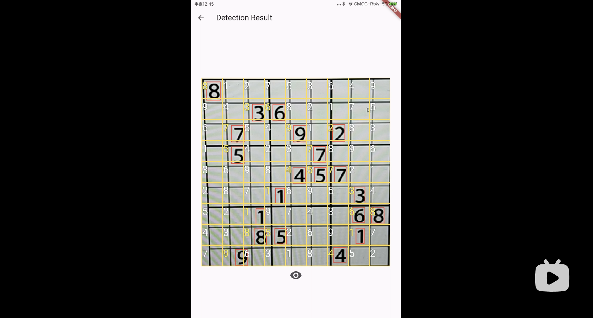

# Sudoku  

[](https://github.com/996icu/996.ICU/blob/master/LICENSE) [](https://opensource.org/licenses/Apache-2.0) [](https://badges.toozhao.com/badges/01EH7R7D3FTYMYYSYDEFCTS251/green.svg "Get your own page views count badge on badges.toozhao.com")
[](https://codemagic.io/apps/645f5680356332a7b6c82326/sudoku-flutter-workflow/latest_build)


## about


an open source Sudoku game application powered by Flutter .

you can build your own Sudoku Game app, which allows you to quickly learn dart/flutter and its ecologically related application techniques, and is very friendly and instructional for tiro .


### recent: 

feature of AI/ML sudoku detect to solver is basically available now , welcome to try and feedback .

[](https://www.bilibili.com/video/BV1BKYteEEer)

<p align="center" style="text-align: center;"> <b>watch</b>: ai solver demo video </p>

about AI/ML model is train by **yolov8** , you can also visit [ultralytics](https://github.com/ultralytics/ultralytics) to know more

download latest release  apk for android (preview) -> [github release page](https://github.com/einsitang/sudoku-flutter/releases)


## screenshots

### iOS


## plan-to-do
- :ballot_box_with_check: AI sudoku solver with camera - working well :-)
- :black_square_button: amendable detection puzzle on  AI Solver
- :black_square_button: AI MODELS optimize with "amendable detection cell"


## environment
- dart SDK: '>=3.0.0 <3.5.0' // records feature support
- flutter SDK: '^3.0.0'
- jdk 11

## dependency
- [opencv_dart](https://github.com/rainyl/opencv_dart)
- [tflite_flutter](https://github.com/tensorflow/flutter-tflite)
- [sudoku_dart](https://github.com/forfuns/sudoku-dart) (sudoku core opensource  lib  )
- [Hive](https://github.com/hivedb/hive)
- [scoped_model](https://github.com/brianegan/scoped_model)
- logger 
- sprintf

## platform support
- android
- iOS
- ~~WEB (no plan support yet)~~

## install
```shell
$> flutter pub get
# options,when you change the lib/state/sudoku_state.dart file,make sure build hive adapter for the project
$> flutter packages pub run build_runner build
```

## run
```shell
$> flutter devices
1 connected device:

iPhone SE (2nd generation) (mobile) • 09684738-362A-468F-80F2-1824A785D324 • ios • com.apple.CoreSimulator.SimRuntime.iOS-13-6 (simulator)

$> flutter run -d 09684738-362A-468F-80F2-1824A785D324
```

## pre-for-build
### android
create a keystore for apk signature

> On Windows
>
> ```shell
> keytool -genkey -v -keystore c:\Users\USER_NAME\key.jks -storetype JKS -keyalg RSA -keysize 2048 -validity 10000 -alias key
> ```
> 

> On Mac/Linux
> ```shell
> keytool -genkey -v -keystore ~/key.jks -keyalg RSA -keysize 2048 -validity 10000 -alias key
> ```

copy `./android/key.properties.example` and rename to `./android/key.properties` that contains a reference to your keystore

more information pls reference official website : https://flutter.dev/docs/deployment/android

### iOS

sign up apple developer

in Xcode,open `./ios/Runner.xcworkspace` to view your app's settings

select the `Runner` project in the Xcode project navigator. then in the main view sidebar,select the `Runner` target and select the `Identity` tab,in the `Signing` section change `Team` and `Bundle Identifier`

more information pls reference official website : https://flutter.dev/docs/deployment/ios

## build
```shell
# iOS
$> flutter build iOS
# android
$> flutter build apk
```


## star history

[](https://star-history.com/#einsitang/sudoku-flutter&Date)

## the end

thanks for visit this repository , wish you can like it and star it :kissing_heart:
