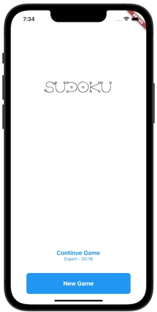
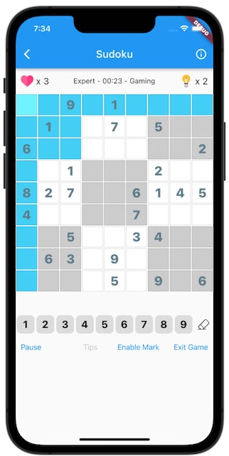

# Sudoku  

[](https://github.com/996icu/996.ICU/blob/master/LICENSE) [](https://opensource.org/licenses/Apache-2.0) [](https://badges.toozhao.com/badges/01EH7R7D3FTYMYYSYDEFCTS251/green.svg "Get your own page views count badge on badges.toozhao.com")
[](https://codemagic.io/apps/645f5680356332a7b6c82326/sudoku-flutter-workflow/latest_build)


## about


A open source Sudoku game application powered by Flutter .

you can build the Sudoku Game just  for your own.

Download apk for android (preview) -> [github release page](https://github.com/einsitang/sudoku-flutter/releases)


## screenshots



## plan-to-do
- [:bangbang:] sudoku solver with camera scan


## environment
- dart SDK: '>=2.18.6 <3.0.0' // Null-Safety
- flutter SDK: '^3.0.0'
- jdk 11

## dependency
- [sudoku_dart](https://github.com/forfuns/sudoku-dart) (sudoku core opensource  lib  )
- [Hive](https://github.com/hivedb/hive)
- [scoped_model](https://github.com/brianegan/scoped_model)
- logger 
- sprintf

## platform support
- android
- iOS
- ~~WEB (no plan support yet)~~

## install
```shell
$> flutter pub get
# options,when you change the lib/state/sudoku_state.dart file,make sure build hive adapter for the project
$> flutter packages pub run build_runner build
```

## run
```shell
$> flutter devices
1 connected device:

iPhone SE (2nd generation) (mobile) • 09684738-362A-468F-80F2-1824A785D324 • ios • com.apple.CoreSimulator.SimRuntime.iOS-13-6 (simulator)

$> flutter run -d 09684738-362A-468F-80F2-1824A785D324
```

## pre-for-build
### android
create a keystore for apk signature

> On Windows
>
> ```shell
> keytool -genkey -v -keystore c:\Users\USER_NAME\key.jks -storetype JKS -keyalg RSA -keysize 2048 -validity 10000 -alias key
> ```
> 

> On Mac/Linux
> ```shell
> keytool -genkey -v -keystore ~/key.jks -keyalg RSA -keysize 2048 -validity 10000 -alias key
> ```

copy `./android/key.properties.example` and rename to `./android/key.properties` that contains a reference to your keystore

more information pls reference official website : https://flutter.dev/docs/deployment/android

### iOS

sign up apple developer

in Xcode,open `./ios/Runner.xcworkspace` to view your app's settings

select the `Runner` project in the Xcode project navigator. then in the main view sidebar,select the `Runner` target and select the `Identity` tab,in the `Signing` section change `Team` and `Bundle Identifier`

more information pls reference official website : https://flutter.dev/docs/deployment/ios

## build
```shell
# iOS
$> flutter build iOS
# android
$> flutter build apk
```

## more flutter features
see the [Flutter](https://flutter.dev/) official website


## star history

[](https://star-history.com/#einsitang/sudoku-flutter&Date)

## the end

thanks for visit this repository , wish you can like it and star it :kissing_heart:
